Module 2 Virtualization and Cloud Basic

Task 2.1

Part 1. HYPERVISORS

1. The leaders in the supply of solutions for virtualization of information systems are VMware, Microsoft, Oracle.
2. Virtualbox can be installed on any operating system, unlike others hypervisors. Virtualbox is free, you cannot allocate more than 256 MB of video memory to a machine. In VMware, there is no such limitation in 2 versions.VMware has a paid version for corporate clients with advanced functionality and a free version with basic application settings.

Part 2. ork with virtualbox

1.First run VirtualBox and Virtual Machine

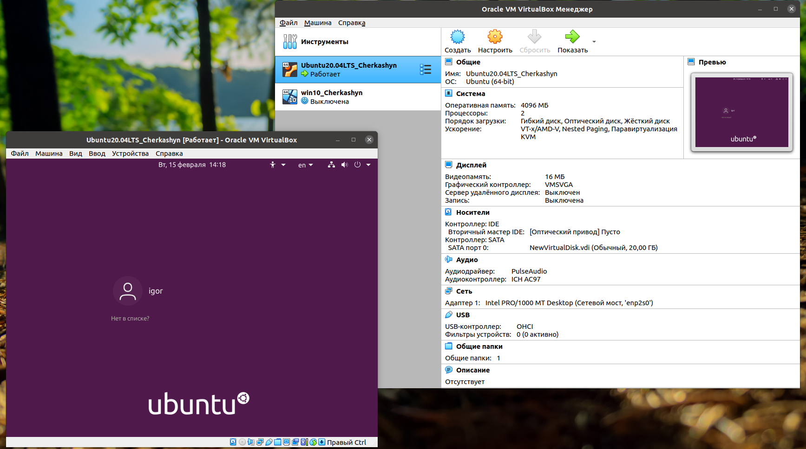

1.1 Then I get acquaited with the structure of the user manual VirtualBox.
1.2 From the official site I downloaded the latest version of program. 
1.3 Download the lateststable version of Ubuntu Desktop from the official site.
1.4 I create VM1 and install Ubuntu using my last name.

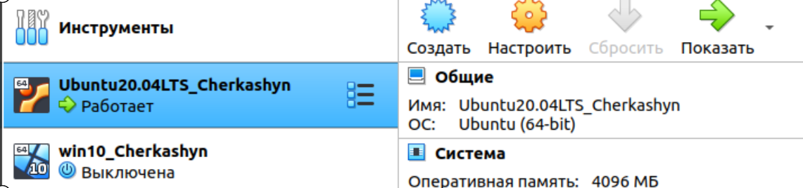

1.5 Get acquaint with the possibilities of VM control

1.6 Then I clone an existing VM by creating VM2

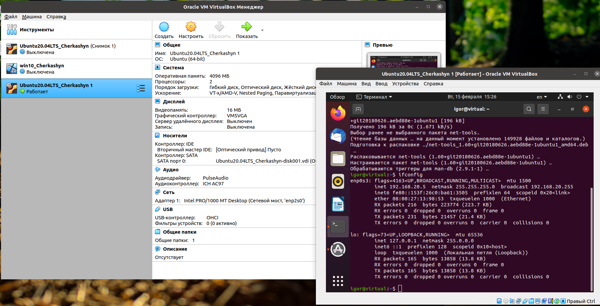

1.7 Create a group of two VM.

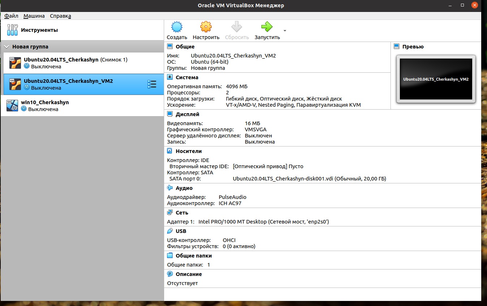

1.8 From VM changing its state 

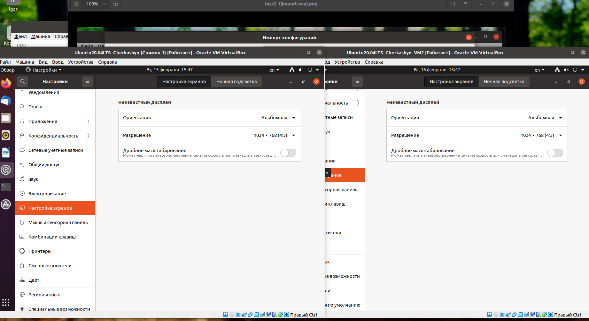

1.9 Export VM Save the *.ova file to disk. Import VM from .ova file

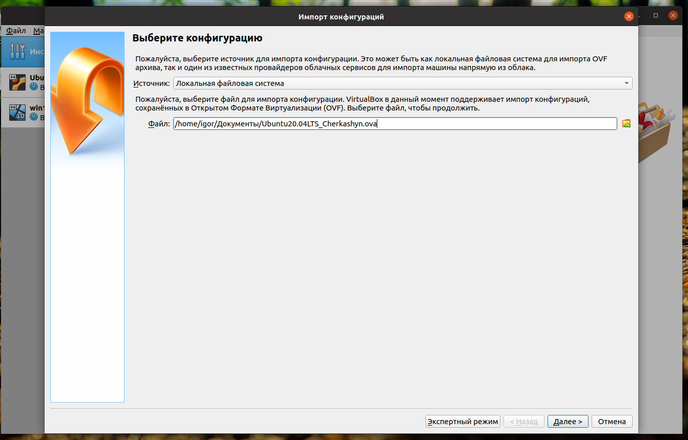

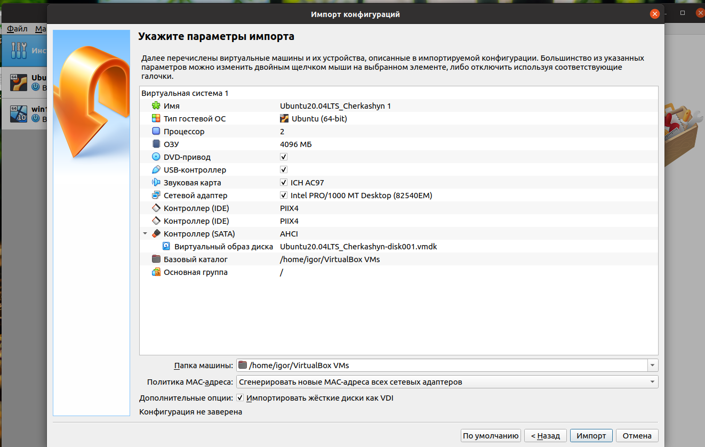

2 Configuration of virtual machine

2.1 Explore VM configuration options

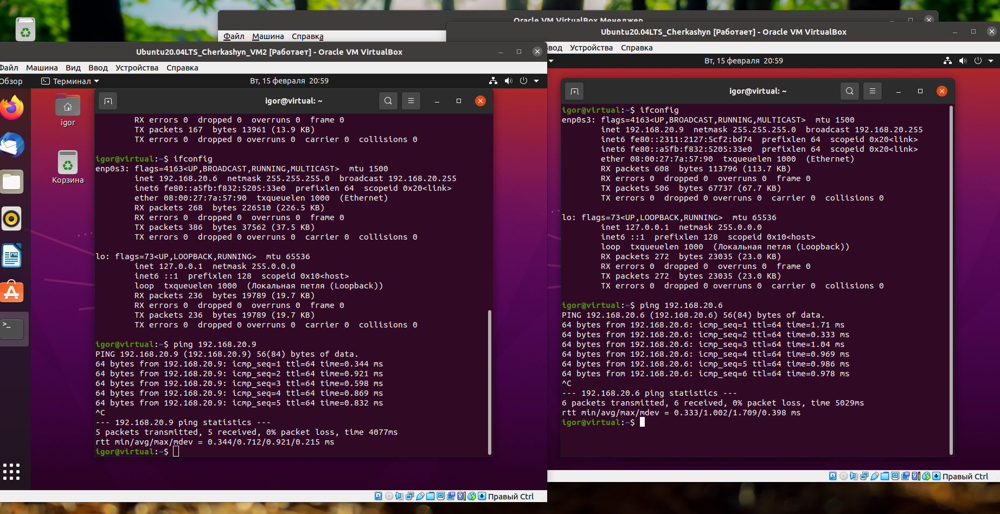

2.2 Configure the USB to connect the USB ports of the host machine to the VM

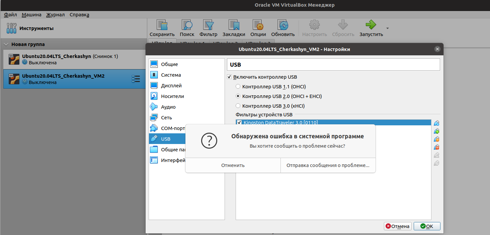

2.3 Configure a shared folder to exchange date between the virtual machine and the host

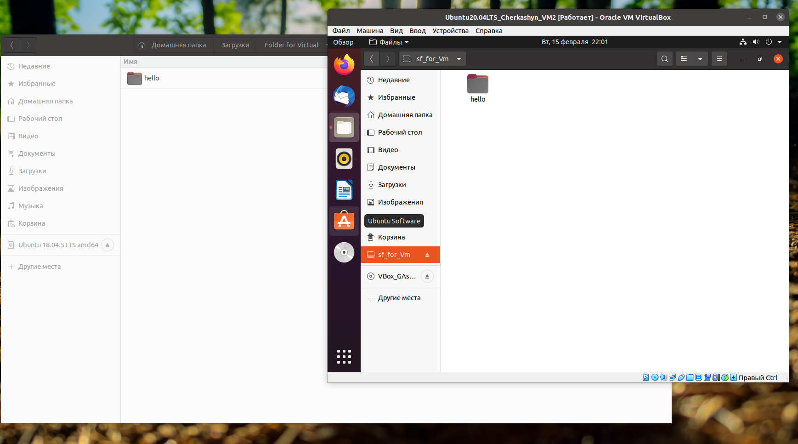

2.4 Configure different network modes for VM1, VM2

PART 3. WORK WITH VAGRANT

1. Download the required version of Vagrant according to the instructions and according to the host operating system install on my PC.

2. I create a folder with my name, open this folder.

3. Initilize the environment with the default Vagrant box

4. Run Vagrant up and watch for messages during VM boot and startup.

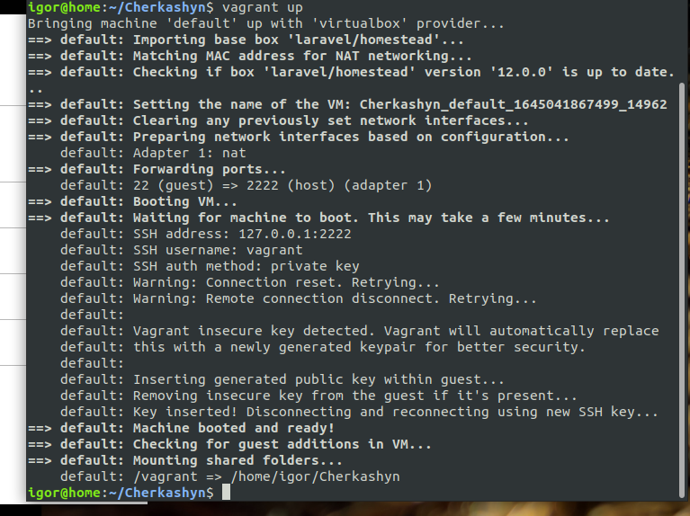

5. Connect to the VM using SSH 

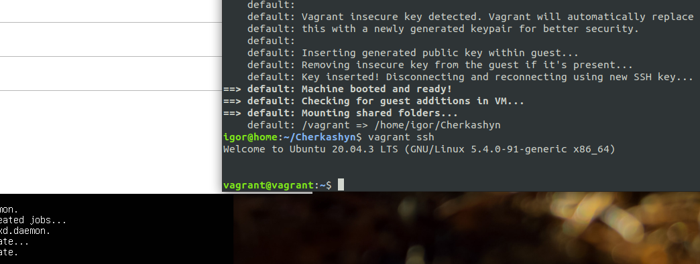

6. Record the date and time by exuting the date command

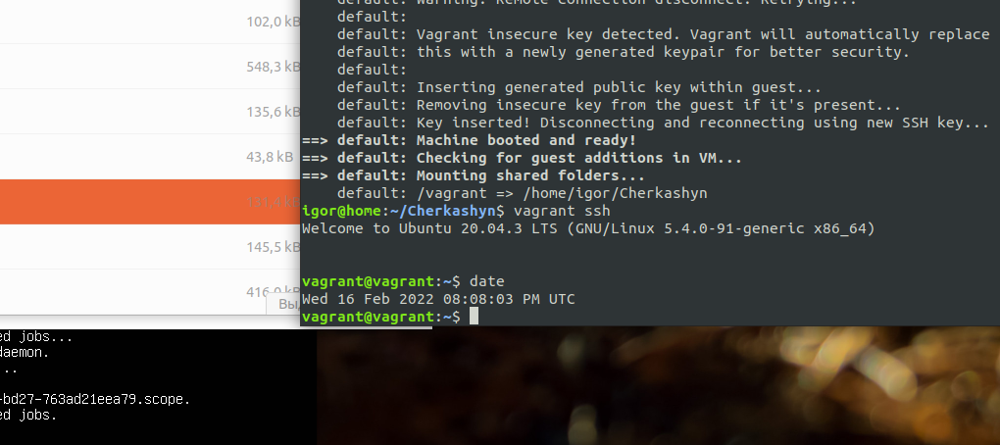

7. Stop and delete the created VM.

